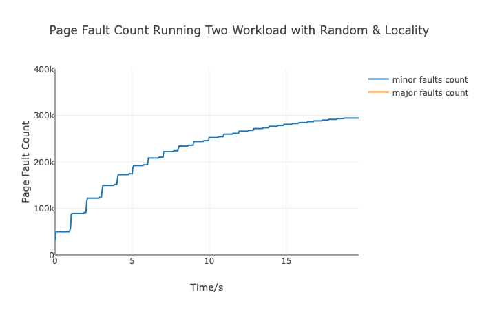

# cs423_mp3
CS 423 MP3 - OS Page Profiler Tool

# Introduce

This the README document of the CS423 MP3, writen by Kechen Lu (kechenl3), is for introducing How-to and the basic implementation ideas of this machine problem, which aims to build a kernel-level module that harvests the page fault and utilization information of registered tasks and exposes them by using a memory buffer that is directly mapped into the virtual address space of the monitor process.

This module is compiled in the Linux Kernel v4.4 which is running over the VM the MP0 has done that. 

Basically, this module runs for sampling the certain OS running information such as CPU utilization time, major page faults and minor page faults. Then in order to reduce the overhead, we would like to avoid the heavy copying beteween user space and kernel space and address it through mapping a part of memory to the character device thus the monitor process can read from this buffer mapping memory. 

In all, this module contains the API usage of character device, proc file system, vmalloc, delayed workqueue and mmap.

# Module Design

## Summary

This MP3 basically want to create a profiling tool with trivial overhead by mmap the allocated memory area to the user space. So generally, we would have to initialize a workqueue to do the delayed work job, vmalloc a memory area and keep it reserved, create a proc file to accept the command from the user work process, and create a character device to mmap the allocated memory to user monitor process for reading and writing profiling information. And in the module exit, we would release all these related resources.

When a first process command R PID to the proc file /proc/mp3/status, we will add this process related to the linked list and queue a delayed work job to the workqueue to complete the sampling job, using the given get_cpu_use() helper func. Then would like to write to pre-allocated buffer. After the last process issue the command U PID, the work queue would cancel/terminate the current pending jobs.

## Design Decisions 

### vmalloc and character device

The core of this MP3 is to correctly manage an allocated area and mmap the allocated kernel virtual address space to the user space of the certain user process like the monitor process in the user space. 

We want to register a new character device driver, so under the cdev API, we use the register_chrdev() to register with open/release/mmap options and get the major number in the module initialization. Then we unregister the character dev in the module exit.

In order to do the mmap and writing the certain profiling information in the kernel space and leverage a large memory area, we want to allocate memory using vmalloc(), which may not have the continuous physical memory but a large virtual continuous space in kernel. After allocation of 128 * 4KB pages, we use SetPageReserved() to set PG_reserved bit for each page. And of course before vfree in the module release, we would ClearPageReserved().

In the mmap, we want to map the physical page to character device the user would read and write. So we iterate all the 128 pages, first getting the physical page frame number from the vmalloc address by vmalloc_to_pfn(), then remap this page to the virtual address of the user space process by remap_pfn_range() with PAGE_SIZE(actually 4KB).

### Delayed Work Job

In the module initialization, we would create an empty workqueue. Then when the first process registration coming, we would queue the delayed work job to the workqueue with delayed 50 ms (20 times per second). 

In the delayed work handler, we would iterate the whole registration list and updating the utilization time(utime + stime), major page fault and minor page fault. Then summarize them for the whole list and write to the vmalloc buffer. And we still use the spin lock to access the registration list. At the end of the work handler, we would like to queue the next delayed work in 50 ms.

And if the last process want to unregistration, we would also clean the workqueue. Using the cancel_delayed_work_sync() to cancel this work job and if it is pending just terminate it and if it is running, this func would return false and we would terminate it again since it queue a new work job.

# Anylysis

## Case Study 1

From the plot below, the two work processes both running with randomly access, we can see the accumulated page faults eventually attain 400k and are almost close to the whole page number of two processes with allocated 1024 MB memory (2 * 2^30 / 2^12 = ~514k pages). And the page faults start accumulating slowly from the 10th s.

And also from the plot below, the two processes with one randomly access and one locality access finally have lower accumulated page faults than the first case , around 300k page faults. As we can see, the page faults would start occuring slowly from 5th s. 

As we can see, there are both no **major page faults**. Since major page faults refer to the disk I/O, there are no major page faults means that no page in the memory swapping out to the disk or swapping into the memory. Through the analysis, we found the assigned virtual machine has the memory size about 4GB, but two process with each 1024 MB account for only up to 50 percent of the memory usage. As a consequence, with enough free memory space and not doing the disk file I/O, there would be no major page faults actually.

And for the **minor page faults,** the first case with two random access shows that higher page fault rates and grows quickly to 400k page faults, while the second one with one random&one locality shows that it has large number of page faults in the begining and soon there are much less occurrence to the page faults after 5s. Minor page faults are mainly because that a process atempts to access a memory portion before it has been initialized. So locality in this work.c is to do the temporal locality which frequently accesses an address in a small duration of time, and thus there would be less chances to access some uninitialized portion of the memory, so the random&locality pattern manifests lower page fault rate.

Comparing the **completion time**, two random access pattern would complete in 5127 jiffies units, and the random with locality pattern could complete in 5122 jiffies units. And it is reasonable because the former one has higher page faults and would cost more time to run the page fault handler. And they are almost same is because of no major page faults to do the disk I/O.

|                      Two Random Access                       |                      Random & Locality                       |
| :----------------------------------------------------------: | :----------------------------------------------------------: |
|  |  |


## Case Study 2


As we can see the plot above, it shows the CPU utilization for 1, 5 and 11 processes of each one accessing 200 MB memory and doing 10000 random access each iteration. Since there are **4096 MB memory** in the assigned VM, so there would be no major page faults as well and thus would not trigger the thrashing because of no need to do expensive swapping in/out between memory and disk. So there is linear growing of the CPU utilization as the processes increase. And for 1, 5 and 11 instances, the completion time also reasons in 4992, 5019 and 5032, and page fault rate shows as below. As we can see, as the process number increases, there are higher page fault rate and so the completion time would be larger than less processes one.


In addition, I had a experiment to test the work and profiler tool in my own VM with **only 1024 MB memory**, the thrashing happens and the 11-instance workload manifest lower CPU utilization as below. It is because os spending more time in waiting disk I/O to swap in and out.


# How-to

## How-to Compile

```bash
$ make all
```

Running make all to compile the user app and kernel modules.

## How-to Install

```bash
$ sudo insmod kechenl3_MP3.ko
```

After installing the module, we will see the log through dmesg, implying the module has been loaded. 

```bash
$ dmesg
[  229.829534] MP3 MODULE LOADING
[  229.830191] MP3 MODULE LOADED
```

## How-to Run

First, we will want to create a character device node. Check the major number by `cat /proc/devices` and find the major number 246 with name `mp3_chrdev` like below. And then runing `mknod node c 246 0` . Then assign it all access privileges `sudo chmod a+rwx ./node`. Then the monitor could open `node` not in sudo.

```bash
kechenl3@sp19-cs423-027:~$ cat /proc/devices 
Character devices:
...
246 mp3_chrdev
...

```

Then, we run the work process like below.

```shell
kechenl3@sp19-cs423-027:~/MP3$ nice ./work 1024 R 50000 & nice ./work 1024 L 10000 &
[1] 10517
[2] 10518
kechenl3@sp19-cs423-027:~/MP3$ A work prcess starts (configuration: 1024 0 50000)
A work prcess starts (configuration: 1024 1 10000)
[10517] 0 iteration
[10518] 0 iteration
[10518] 1 iteration
[10517] 1 iteration
[10518] 2 iteration
[10517] 2 iteration
[10518] 3 iteration
[10517] 3 iteration
[10518] 4 iteration
[10517] 4 iteration
[10518] 5 iteration
[10517] 5 iteration
[10518] 6 iteration
[10517] 6 iteration
[10518] 7 iteration
[10517] 7 iteration
[10518] 8 iteration
[10517] 8 iteration
[10518] 9 iteration
[10517] 9 iteration
[10518] 10 iteration
[10517] 10 iteration
[10518] 11 iteration
[10517] 11 iteration
[10518] 12 iteration
[10517] 12 iteration
[10518] 13 iteration
[10517] 13 iteration
[10518] 14 iteration
[10517] 14 iteration
[10518] 15 iteration
[10517] 15 iteration
[10518] 16 iteration
[10517] 16 iteration
[10518] 17 iteration
[10517] 17 iteration
[10518] 18 iteration
[10517] 18 iteration
[10518] 19 iteration
[10517] 19 iteration

[2]+  Done                    nice ./work 1024 L 10000
kechenl3@sp19-cs423-027:~/MP3$ 
[1]+  Done                    nice ./work 1024 R 50000
```

Then we can have the monitor to collect the profiler data.

```shell
kechenl3@sp19-cs423-027:~/MP3$ ./monitor
4300073608 30121 0 15
4300073621 19405 0 8
4300073634 0 0 0
4300073647 0 0 0
4300073660 0 0 0
4300073673 0 0 0
4300073686 0 0 0
4300073699 0 0 0
4300073712 0 0 0
4300073725 0 0 0
4300073738 0 0 0
...
```


